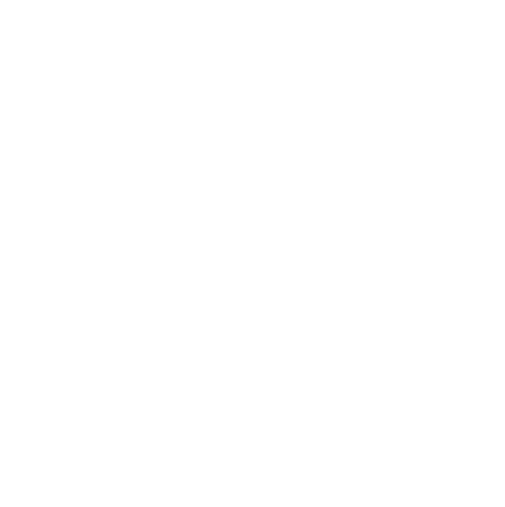
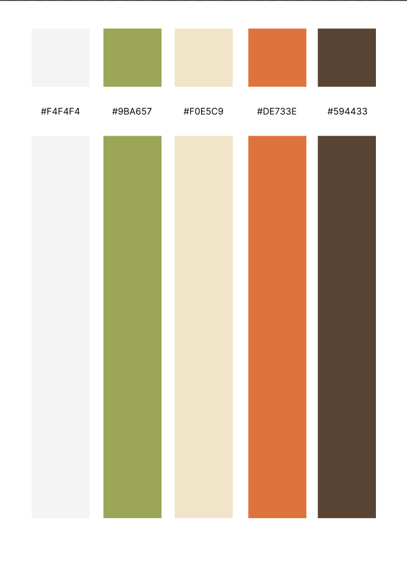

# Proyecto-Taltech  
### TALTECH - IDENTIDAD DEL SISTEMA

Taltech es una plataforma web orientada a la gestión ganadera, diseñada para modernizar y optimizar los procesos administrativos dentro del sector pecuario. La identidad del sistema se centra en la eficiencia, accesibilidad y digitalización del campo, permitiendo transformar prácticas tradicionales en procesos basados en datos.

---

## LOGOTIPOS

<table>
   <td>Logo de la Aplicación</td>
   <td>Logo del Sistema</td>
  <tr>
    <td>    </td>
    <td>    </td>
  </tr>
</table>

---

## DESCRIPCIÓN

Taltech es una aplicación web que permite centralizar la gestión de múltiples ranchos, facilitando el control del ciclo de vida del ganado, incluyendo su registro, salud, alimentación y crecimiento. Además, proporciona reportes en tiempo real que apoyan la toma de decisiones estratégicas dentro del negocio ganadero.

---

### PLANTEAMIENTO DEL PROBLEMA

En la actualidad, una gran parte de los ganaderos continúa gestionando la información de sus ranchos mediante métodos manuales como libretas, hojas sueltas o registros desordenados. Este modelo provoca diversos problemas: pérdida o duplicación de datos, errores en el control de ganado, dificultad para consultar información histórica y poca capacidad para tomar decisiones informadas.
A estas limitaciones se suma que la mayoría de las herramientas digitales disponibles no están adaptadas al nivel tecnológico del usuario final, lo que crea barreras para su uso y limita su adopción. La falta de interfaces simples, menús intuitivos y procesos guiados genera confusión y reduce la eficiencia operativa.
La necesidad central es contar con una solución que digitalice los registros del rancho, sea fácil de aprender, brinde retroalimentación clara, minimice errores y permita gestionar el ganado desde cualquier dispositivo de manera confiable.

---

## PROPUESTA DE SOLUCIÓN

Se propone el desarrollo de una plataforma web que permita digitalizar la gestión ganadera mediante un sistema centralizado, accesible y fácil de usar. Taltech integra funcionalidades para el registro de animales, control sanitario, administración de ranchos y generación de reportes, contribuyendo a una gestión eficiente y rentable.

---

## OBJETIVO GENERAL

Diseñar e implementar una plataforma web para la gestión ganadera que permita centralizar la información de múltiples ranchos, administrar el ciclo de vida del ganado y facilitar la toma de decisiones mediante datos confiables.

---

## OBJETIVOS ESPECÍFICOS

- **Gestión de datos:** Permitir el registro, consulta y actualización de información del ganado.  
- **Administración multirrancho:** Gestionar múltiples propiedades desde una sola cuenta.  
- **Control sanitario:** Registrar historial médico, vacunación y tratamientos.  
- **Seguimiento productivo:** Controlar crecimiento, alimentación y rendimiento del ganado.  
- **Seguridad de la información:** Proteger datos mediante autenticación y validaciones.  
- **Facilidad de uso:** Diseñar una interfaz accesible para usuarios con poca experiencia tecnológica.  

---
## IDENTIDAD GRAFICA
Logo del proyecto:

---

## PALETA DE COLORES

---

## DIAGRAMA DE GANTT

---

## JUSTIFICACIÓN DEL PROYECTO

El proyecto surge ante la necesidad de modernizar el sector ganadero, donde aún predominan prácticas tradicionales. La digitalización permite mejorar la organización de la información, reducir errores humanos y optimizar la toma de decisiones. Además, contribuye a incrementar la rentabilidad del negocio y mejorar la eficiencia operativa.

---

## BENEFICIOS

- Reducción de errores en registros  
- Acceso a información en tiempo real  
- Mejora en la toma de decisiones  
- Centralización de datos  
- Incremento de productividad  

---

## ALCANCES Y LIMITACIONES

### Alcances
- Registro y control de ganado  
- Gestión de usuarios  
- Administración de ranchos  
- Visualización mediante dashboards  

### Limitaciones
- Dependencia de conexión a internet  
- Recursos tecnológicos limitados en zonas rurales  
- No integración con dispositivos IoT  
- Funcionalidades limitadas por tiempo académico  

---

## METODOLOGÍA

El desarrollo del sistema se realizó utilizando la metodología ágil Scrum, organizando el trabajo en iteraciones (sprints) que permitieron una mejora continua del sistema durante las fases de análisis, diseño, desarrollo y pruebas.

---

## ARQUITECTURA DEL SISTEMA

Taltech utiliza una arquitectura cliente-servidor de tres capas:

- **Frontend:** Interfaz de usuario  
- **Backend:** Lógica de negocio  
- **Base de datos:** Almacenamiento de información  

Esta arquitectura permite escalabilidad, mantenimiento eficiente y acceso desde múltiples dispositivos.

---

## RESULTADOS

- Reducción del tiempo de registro de 10 min a 2 min  
- Disminución de errores en captura de datos  
- Mejora en organización de información  
- Toma de decisiones basada en datos  

---

## TABLA DE COLABORADORES

| Integrante | Contacto | Rol | 
|------------|----------|-----|
| Angel Saul Barrios Martinez | [@Angel-Saul](https://github.com/Angel-Saul) | Líder de equipo y desarrollador de frontend | 
| Jonhy Neri Hernandez | [@Jonhy-1st](https://github.com/Jonhy-1st) | Desarrollador de bases de datos | 
| Luis Felipe Cazarez Marquez | [@xluiscm](https://github.com/xluiscm) | Desarrollador de backend | 
| Aylin Esteban Luna | [@Aylin-Luna](https://github.com/Aylin-Luna) | Desarrollador de documentación | 
---

## ORGANIGRAMA DEL EQUIPO

---

## MODELO DE BASE DE DATOS

El sistema se basa en un modelo entidad-relación compuesto por las siguientes entidades:

- Usuario  
- Rancho  
- Animal  
- Registro de Salud  

Las relaciones principales son de tipo uno a muchos, permitiendo una correcta trazabilidad del ganado.

---

## LISTA DE TECNOLOGÍAS

### Cliente

### Servidor

### Base de Datos

### Herramientas

---

## CONCLUSIONES

Taltech demuestra que la implementación de tecnologías web en el sector ganadero mejora significativamente la gestión de la información, reduce errores y facilita la toma de decisiones. Representa una solución viable para la digitalización del campo.

---

## RECOMENDACIONES

- Implementar modo offline  
- Integrar dispositivos IoT  
- Añadir análisis predictivo  
- Capacitar a usuarios  